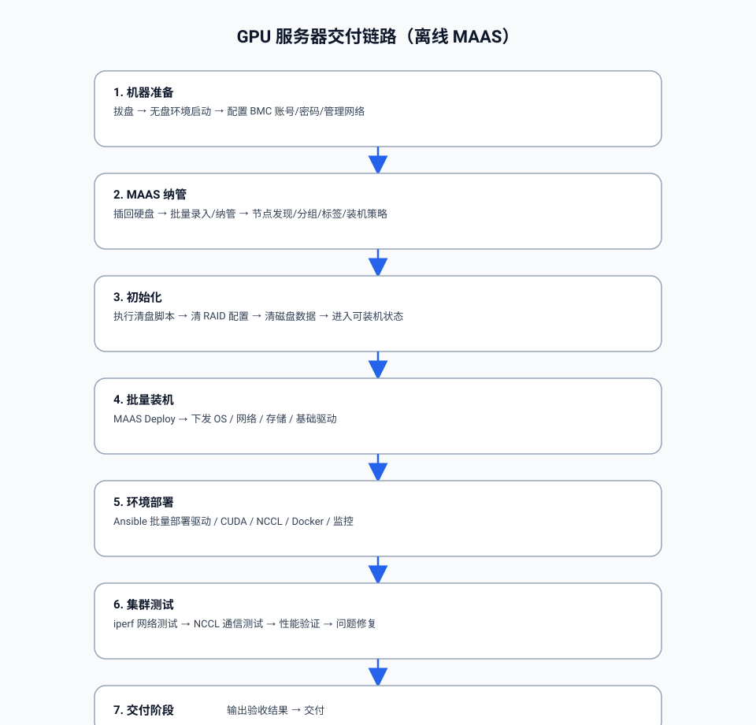

# MAAS 离线部署与 GPU 服务器交付 Runbook

## 流程图



## 0. 目标与约束

- 目标：离线环境下完成 GPU 服务器的纳管、清盘初始化、批量装机，并形成可复用的操作手册。
- 约束：集群节点无法联网；所有依赖（ISO、apt 镜像、工具）必须由内网 HTTP 提供。
- 结论：全新离线部署不能只准备 ISO；至少要同时准备 `mirror`、`iso`、`tools` 三类资源后，MAAS commissioning 和 deploy 才能稳定完成。

### 0.1 当前“一键离线部署”的能力边界

当前仓库已经可以做到“条件式一键部署”，但不是“裸机零准备全自动”：

- 可以一键完成：
  - 统一离线资源目录归并
  - 多路径离线 HTTP 服务安装与拉起
  - `boot-source` / 包仓库 / storage / deploy / curtin 登录模板 的标准化落地
  - 基于 CSV 的批量纳管、打标签、套盘、批量部署
- 还不能完全替代的前置准备：
  - MAAS 控制机操作系统安装
  - `maas-region` / `maas-rack` 软件包安装与初始化
  - 网络、VLAN、DHCP、路由、交换机连通性规划
  - BMC/IPMI 凭据采集
  - 节点 BIOS/UEFI 与 PXE 启动策略校准
- 因此更准确的说法是：
  - 如果 MAAS 主机已经装好，且离线资源与 CSV/BMC 数据已备齐，本仓库可以把新环境的离线交付流程压缩到“一套资源准备 + 一套标准命令链”
  - 如果是从一台裸机开始新建整个 MAAS 环境，仍需要先把基础 OS、MAAS 软件和网络条件准备好

### 0.2 当前测试版本矩阵

以下版本来自当前已验证环境 `10.161.139.136`，采集时间为 `2026-05-26`：

- 控制机系统：Ubuntu 22.04
- MAAS 部署方式：deb package
- `maas-region-api`：`1:3.4.9-14399-g.48cea136e-0ubuntu1~22.04.1`
- `maas-rack-controller`：`1:3.4.9-14399-g.48cea136e-0ubuntu1~22.04.1`
- `maas-cli`：`1:3.4.9-14399-g.48cea136e-0ubuntu1~22.04.1`
- `cloud-init`：`25.3-0ubuntu1~22.04.1`
- `curtin-common` / `python3-curtin`：`23.1.1-1118-g3977ce90-0ubuntu1~ubuntu22.04.1`
- `grub-efi-amd64` / `grub-efi-amd64-bin`：`2.06-2ubuntu14.8`
- `grub-efi-amd64-signed`：`1.187.12+2.06-2ubuntu14.8`
- `shim-signed`：`1.51.4+15.8-0ubuntu1`
- `python3-yaml`：`5.4.1-1ubuntu1`

说明：

- 上述版本是当前 runbook 和脚本已验证通过的基线
- 后续如果更换 MAAS 主版本、cloud-init、curtin 或 grub 版本，建议先单机回归，再批量部署
- `apt-cache policy` 显示当前验证环境里的 `maas-region-api` / `maas-rack-controller` 候选版本与已安装版本一致，现场没有更高版本可直接切换

### 0.3 离线 MAAS 能否做到一键部署

当前结论分两层：

- 可以一键的部分：
  - 统一离线资源目录
  - 离线 HTTP 服务
  - MAAS 的 `boot-source` / `package-repository`
  - CSV 纳管、打标签、套盘、部署、curtin 登录模板
- 还不能一键的部分：
  - 从裸机开始安装 Ubuntu 控制机
  - 从零安装并初始化 MAAS region/rack 软件包
  - 自动完成 PostgreSQL、网络、VLAN、DHCP、BMC 数据采集

因此当前仓库最准确的能力描述是：

- 已支持“MAAS 控制端初始化完成后的条件式一键离线交付”
- 暂未支持“从裸机到 MAAS 控制端完全自动化”的一键拉起

### 0.4 PXE 控制面与 Web 控制台规划

当前阶段先采用“分时独占”策略管理无盘采集环境与 MAAS 装机环境：

- 同一个二层广播域内，同一批 PXE 客户端不同时接受无盘 DHCP/TFTP 和 MAAS DHCP/TFTP
- 阶段 1 无盘采集时，启用无盘 DHCP/TFTP/HTTP，停用 MAAS 对目标网段的 PXE 引导
- 阶段 1 完成并导出 `maas.csv` 后，停用无盘 DHCP/TFTP，再启用 MAAS DHCP/TFTP/PXE
- 已部署机器保持本地盘优先启动，除非现场明确设置一次性 PXE Boot

这样做的目标是避免 DHCP 抢答、TFTP 入口混乱、节点进错启动环境，以及 MAAS 产生半成品发现记录。

后续计划增加 Web 控制台作为统一操作面，覆盖：

- 集群总览、节点状态、异常统计、批量任务
- 阶段 1 无盘采集与 BMC 配置状态
- 分时独占服务模式切换
- MAAS 纳管、清盘、套盘、部署编排
- 排障原因聚合和操作审计

设计草案见 [MAAS_Web_Console_Design.md](./MAAS_Web_Console_Design.md)。

端到端推进计划见 [MAAS_End_to_End_Execution_Plan.md](./MAAS_End_to_End_Execution_Plan.md)。

Stage1 手动测试见 [stage1/Stage1_Diskless_Manual_Test.md](./stage1/Stage1_Diskless_Manual_Test.md)。

当前可用脚本入口：

- MAAS 控制端一键部署：[maas-control-plane-oneclick.sh](./maas-control-plane-oneclick.sh)
- 无盘 Stage1 一键部署：[diskless-stage1-oneclick.sh](./diskless-stage1-oneclick.sh)
- PXE 分时独占模式切换：[scripts/maas_pxe_mode.sh](./scripts/maas_pxe_mode.sh)
- 本地 smoke 验证：[scripts/offline_deploy_smoke_test.sh](./scripts/offline_deploy_smoke_test.sh)

Docker 验证说明见 [docker/README.md](./docker/README.md)。

## 1. 离线资源服务（单服务 + 单端口 + 单根目录）

### 1.1 目录规划（示例）

- 统一根目录：`/srv/maas-offline`
- APT 镜像目录：`/srv/maas-offline/mirror`
- ISO 目录：`/srv/maas-offline/iso`
- 工具目录：`/srv/maas-offline/tools`

### 1.2 用一个端口对外提供三类资源

仓库内提供了一个轻量的多路径静态文件服务脚本：

- 服务脚本：[maas-offline-http.py](./maas-offline-http.py)
- systemd 单元样例：[maas-offline-http.service](./systemd/maas-offline-http.service)

建议统一用 `8083`，并把 commissioning 依赖的 APT 仓库也一起收口到这个服务：

- `http://10.161.139.136:8083/mirror/` → `/srv/maas-offline/mirror`
- `http://10.161.139.136:8083/iso/` → `/srv/maas-offline/iso`
- `http://10.161.139.136:8083/tools/` → `/srv/maas-offline/tools`
- `http://10.161.139.136:8083/diskless/` → `/srv/maas-offline/diskless`
- `http://10.161.139.136:8083/stage1/` → `/srv/maas-offline/stage1`
- `http://10.161.139.136:8083/tools/lldpd-mini-repo/` → `/srv/maas-offline/tools/lldpd-mini-repo`

### 1.3 部署为 systemd 服务

在 `10.161.139.136` 上执行：

```bash
sudo mkdir -p /srv/maas-offline/{mirror,iso,tools,diskless,stage1}
sudo mkdir -p /opt/maas-offline
sudo cp ./docs/maas-offline-http.py /opt/maas-offline/maas-offline-http.py
sudo chmod +x /opt/maas-offline/maas-offline-http.py

sudo cp ./docs/systemd/maas-offline-http.service /etc/systemd/system/maas-offline-http.service
sudo systemctl daemon-reload
sudo systemctl enable --now maas-offline-http.service

sudo systemctl status maas-offline-http.service --no-pager
journalctl -u maas-offline-http.service -n 100 --no-pager
```

如果你之前已经把资源分散放在旧目录，可以先归并到统一根目录：

```bash
sudo mkdir -p /srv/maas-offline/{mirror,iso,tools,diskless,stage1}
sudo rsync -a /srv/maas-mirror/ /srv/maas-offline/mirror/
sudo rsync -a /root/ubuntu22.04.4/ /srv/maas-offline/iso/
sudo rsync -a /root/tools/ /srv/maas-offline/tools/
sudo rsync -a /srv/lldpd-mini-repo/ /srv/maas-offline/tools/lldpd-mini-repo/
```

如果希望“一键替换旧的临时 HTTP 服务 + 拉起统一的 systemd 服务”，可直接用：

```bash
chmod +x ./docs/maas-offline-oneclick.sh
./docs/maas-offline-oneclick.sh
```

该脚本会做这些事：

- 统一使用 `/srv/maas-offline/{mirror,iso,tools,diskless,stage1}`
- 自动从旧目录 `/srv/maas-mirror`、`/root/ubuntu22.04.4`、`/root/tools` 迁移文件
- 自动把 `lldpd` 离线仓库归并到 `/srv/maas-offline/tools/lldpd-mini-repo`
- 停掉旧的 `python3 -m http.server 8081/8082/8083/8899`
- 重新安装并启动 `maas-offline-http.service`
- 自动补齐 `ephemeral-v3` 下缺失的 `lowlatency/boot-kernel` 和 `lowlatency/boot-initrd`

部署后自检：

```bash
curl -I http://10.161.139.136:8083/mirror/
curl -I http://10.161.139.136:8083/iso/
curl -I http://10.161.139.136:8083/tools/
curl -I http://10.161.139.136:8083/diskless/
curl -I http://10.161.139.136:8083/stage1/
```

进一步确认 systemd 实际映射目录：

```bash
systemctl cat maas-offline-http
systemctl status maas-offline-http --no-pager
```

`ExecStart` 必须是：

```text
/usr/bin/python3 /opt/maas-offline/maas-offline-http.py --bind 0.0.0.0 --port 8083 --map /mirror=/srv/maas-offline/mirror --map /iso=/srv/maas-offline/iso --map /tools=/srv/maas-offline/tools --map /diskless=/srv/maas-offline/diskless --map /stage1=/srv/maas-offline/stage1
```

如果之前 MAAS boot-source 还指向旧地址 `8081`，要同步改成：

```bash
maas admin boot-source update 1 \
  url=http://10.161.139.136:8083/mirror/ephemeral-v3/stable/ \
  keyring_filename=/usr/share/keyrings/ubuntu-cloudimage-keyring.gpg
maas admin boot-resources import
sudo systemctl restart maas-rackd maas-regiond
```

commissioning 使用的包仓库也要同步改到 `8083`，避免节点在 `cloud-init` 或 `20-maas-01-install-lldpd` 阶段因为旧的 `8082/8899` 进程缺失而失败：

```bash
maas admin package-repository update 1 \
  url=http://10.161.139.136:8083/iso

maas admin package-repository update 3 \
  url=http://10.161.139.136:8083/tools/lldpd-mini-repo

maas admin package-repositories read | jq '.[] | {id,name,url,enabled}'
```

如果 `lldpd-mini-repo` 是自建仓库，必须补 `InRelease`/`Release.gpg` 并把公钥写入 MAAS；否则 commissioning 节点即使能访问该 URL，也可能仍然报：

- `E: Unable to locate package lldpd`
- `maas-capture-lldpd failed`

推荐做法：

```bash
export GNUPGHOME=/root/.gnupg-maas-repo
mkdir -p "$GNUPGHOME"
chmod 700 "$GNUPGHOME"

cat >/tmp/maas-repo-key.batch <<'EOF'
%no-protection
Key-Type: RSA
Key-Length: 4096
Name-Real: MAAS Offline Repo Signing
Name-Email: maas-offline@example.local
Expire-Date: 0
%commit
EOF

gpg --batch --generate-key /tmp/maas-repo-key.batch
gpg --batch --armor --export 'MAAS Offline Repo Signing' >/tmp/maas-offline-repo-signing.asc

gpg --batch --yes --default-key 'MAAS Offline Repo Signing' \
  --detach-sign --armor \
  -o /srv/maas-offline/tools/lldpd-mini-repo/dists/jammy/Release.gpg \
  /srv/maas-offline/tools/lldpd-mini-repo/dists/jammy/Release

gpg --batch --yes --default-key 'MAAS Offline Repo Signing' \
  --clearsign \
  -o /srv/maas-offline/tools/lldpd-mini-repo/dists/jammy/InRelease \
  /srv/maas-offline/tools/lldpd-mini-repo/dists/jammy/Release

maas admin package-repository update 3 \
  key="$(cat /tmp/maas-offline-repo-signing.asc)"
```

验收标准：

- `main_archive` 必须是 `http://10.161.139.136:8083/iso`
- `lldpd-mini` 必须是 `http://10.161.139.136:8083/tools/lldpd-mini-repo`
- 不再保留 `8082` / `8899` 的单独 `python3 -m http.server` 进程
- `maas-ubuntu-apt-http.service` 和 `lldpd-mini-repo.service` 必须停用
- `lldpd-mini` 仓库必须存在 `InRelease` 或 `Release.gpg`，且 preseed 中能看到对应 `key`

自检命令：

```bash
curl -I http://10.161.139.136:8083/iso/dists/jammy/Release
curl -I http://10.161.139.136:8083/tools/lldpd-mini-repo/dists/jammy/Release
curl -I http://10.161.139.136:8083/tools/lldpd-mini-repo/dists/jammy/InRelease
ss -ltnp | egrep ':8082|:8899|:8083'
systemctl list-unit-files | egrep 'maas-offline-http|maas-ubuntu-apt-http|lldpd-mini-repo'
```

如果要验证 `simplestreams` 启动文件是否齐全，直接检查：

```bash
curl -I http://10.161.139.136:8083/mirror/ephemeral-v3/stable/streams/v1/index.sjson
curl -I http://10.161.139.136:8083/mirror/ephemeral-v3/stable/jammy/amd64/20260430/ga-22.04/generic/boot-kernel
curl -I http://10.161.139.136:8083/mirror/ephemeral-v3/stable/jammy/amd64/20260430/ga-22.04/lowlatency/boot-kernel
```

### 1.4 工具分发约定

清盘脚本会按需从 `BASE_URL` 下载工具：

- `storcli_007.2508.0000.0000_all.deb`
- `MegaCli64`
- `sas3ircu`
- `sas2ircu`

建议统一放在 `/srv/maas-offline/tools/` 下，通过：

- `http://10.161.139.136:8083/tools/<文件名>` 访问

### 1.4.1 离线安装与初始化 MAAS 控制端

如果是全新的离线环境，建议先手动完成 MAAS 控制端最小初始化，再使用仓库里的“一键”脚本接管后续流程。

推荐最短步骤如下：

1. 安装 Ubuntu 22.04 控制机，并先把管理口网络配好

- 建议从安装期开始使用 predictable interface names
- 当前仓库推荐固定使用 `ens12f0np0`、`ens12f1np1`
- 如果后续要接管部署节点网络，也建议控制机自身先统一这套命名习惯

2. 把控制机 APT 源指向离线 Ubuntu 仓库

例如：

```bash
cat >/etc/apt/sources.list <<'EOF'
deb http://<server-ip>:8083/iso jammy main restricted universe multiverse
deb http://<server-ip>:8083/iso jammy-updates main restricted universe multiverse
deb http://<server-ip>:8083/iso jammy-security main restricted universe multiverse
EOF

apt-get update
```

3. 安装 MAAS 相关软件包

```bash
apt-get install -y \
  maas-region-api \
  maas-rack-controller \
  maas-cli \
  cloud-init \
  curtin-common \
  python3-yaml
```

4. 初始化 MAAS region/rack

当前 runbook 不替代官方 `maas init` 参数说明；数据库参数以现场模式为准：

- 如果使用外部 PostgreSQL，按你的 `postgres://...` 连接串初始化
- 如果使用本机 PostgreSQL，按当前版本 `maas init --help` 的推荐参数执行

最小参考命令：

```bash
maas init region+rack --maas-url http://<server-ip>:5240/MAAS
maas createadmin --username admin --password '<password>' --email '<email>'
API_KEY="$(maas apikey --username admin)"
maas login admin http://<server-ip>:5240/MAAS "$API_KEY"
```

注意：

- 不同 MAAS 小版本的 `init` 参数和数据库初始化提示可能略有差异，现场以 `maas init --help` 为准
- 当前仓库还没有把这一步做成稳定的一键脚本，所以控制端初始化仍建议手动执行

5. 控制端初始化完成后，再切到仓库自动化

后续即可直接运行：

```bash
chmod +x ./docs/maas-offline-oneclick.sh
./docs/maas-offline-oneclick.sh
```

再继续执行：

```bash
maas admin boot-source update 1 \
  url=http://<server-ip>:8083/mirror/ephemeral-v3/stable/ \
  keyring_filename=/usr/share/keyrings/ubuntu-cloudimage-keyring.gpg
maas admin boot-resources import

maas admin package-repository update 1 url=http://<server-ip>:8083/iso
maas admin package-repository update 3 url=http://<server-ip>:8083/tools/lldpd-mini-repo
```

结论：

- 如果问“离线怎么部署配置 MAAS”，当前答案是：
  - 先手动完成 Ubuntu + MAAS region/rack 的最小安装初始化
  - 再用仓库脚本接管离线资源服务、boot-source、package repo、纳管、套盘、部署
- 如果问“能不能做到一键部署”，当前答案是：
  - 控制端初始化后，可以
  - 从裸机开始，到 MAAS 本体全部自动化，当前仓库还没有做到

### 1.5 全新离线环境资源清单

如果要在全新的离线环境里复现当前这套自动化交付，至少要提前准备这些资源：

- MAAS 控制机基础环境
  - Ubuntu 22.04 主机
  - 已安装并初始化的 `maas-region-api` / `maas-rack-controller`
  - 可用的 `admin` CLI profile/API 凭据
- Boot 资源
  - `simplestreams` mirror，至少包含 `ephemeral-v3/stable`
  - Jammy 对应的 `boot-kernel` / `boot-initrd` / `squashfs`
  - 如使用 `lowlatency` 路径，需补齐对应启动文件
- APT/ISO 资源
  - Ubuntu Jammy 离线仓库，能作为 `main_archive`
  - 挂在 `/srv/maas-offline/iso`
- 工具资源
  - RAID 工具：`storcli`、`MegaCli64`、`sas3ircu`、`sas2ircu`
  - 其他 commissioning/deploy 所需离线文件
  - `lldpd-mini-repo`，且带 `InRelease` 或 `Release.gpg`
- 配置与清单
  - `deploy-policy.yaml`
  - `deploy-policy-install-safe.yaml`
  - `maas-machines.csv`
  - BMC 凭据、序列号、PXE MAC、可选 25G/bond 配置
- 网络与硬件前置条件
  - 管理网二层打通
  - PXE/DHCP/TFTP/HTTP 可达
  - 机器 BIOS 已设为 UEFI，本地盘优先，PXE 仅靠一次性 Boot Override

### 1.6 全新离线环境最短落地顺序

如果上述资源已经备齐，推荐按这条最短路径拉起新环境：

1. 拉起统一离线 HTTP 服务：

```bash
chmod +x ./docs/maas-offline-oneclick.sh
./docs/maas-offline-oneclick.sh
```

2. 更新 MAAS boot-source 与 package repositories：

```bash
maas admin boot-source update 1 \
  url=http://<server-ip>:8083/mirror/ephemeral-v3/stable/ \
  keyring_filename=/usr/share/keyrings/ubuntu-cloudimage-keyring.gpg
maas admin boot-resources import

maas admin package-repository update 1 url=http://<server-ip>:8083/iso
maas admin package-repository update 3 url=http://<server-ip>:8083/tools/lldpd-mini-repo
```

3. 导入节点并打标签：

```bash
PROFILE=admin ./docs/scripts/maas_bulk_import_and_tag.sh /root/maas-machines.csv
```

4. 安装 curtin 登录模板：

```bash
sudo python3 ./docs/scripts/maas_install_curtin_login_template.py \
  --config ./docs/cloud-init/deploy-policy.yaml \
  --csv /root/maas-machines.csv
```

5. 套用存储策略：

```bash
PROFILE=admin ./docs/scripts/maas_apply_storage_policy.py \
  --csv /root/maas-machines.csv \
  --all-ready --include-failed-deployment
```

6. 批量部署：

```bash
PROFILE=admin SERIES=jammy ./docs/scripts/maas_deploy_batch.sh \
  --csv /root/maas-machines.csv \
  --all-ready --include-failed-deployment
```

### 1.7 MAAS 控制端一键入口

如果要把控制端离线安装、初始化和资源配置合并成一个入口，使用：

```bash
./docs/maas-control-plane-oneclick.sh \
  --server-ip <server-ip> \
  --admin-password '<password>'
```

该脚本默认执行：

- 拉起统一离线 HTTP 服务
- 检查 Ubuntu 22.04 / Jammy 节点部署所需资源
- 写入离线 apt 源
- 安装 `maas-region-api`、`maas-rack-controller`、`maas-cli`、`cloud-init`、`curtin-common`、`python3-yaml`
- 执行 `maas init region+rack`
- 创建 admin 用户并登录 MAAS CLI profile
- 配置 `boot-source`
- 配置 `main_archive` 和 `lldpd-mini-repo`
- 触发 boot resources import

本地或容器里先做非破坏性验证：

```bash
./docs/maas-control-plane-oneclick.sh \
  --dry-run \
  --server-ip 127.0.0.1 \
  --admin-password SmokeTest123
```

如果现场已经完成某些步骤，可以用 `--skip-*` 跳过，例如：

```bash
./docs/maas-control-plane-oneclick.sh \
  --server-ip <server-ip> \
  --admin-password '<password>' \
  --skip-init \
  --skip-admin
```

### 1.8 无盘 Stage1 一键入口

无盘采集服务使用：

```bash
./docs/diskless-stage1-oneclick.sh \
  --server-ip <server-ip>
```

默认行为：

- 准备 `/srv/maas-offline/diskless/ubuntu-22.04`
- 准备 `/srv/maas-offline/stage1`
- 安装并启动 `stage1-collector.service`
- 复用统一 HTTP 服务暴露 `/diskless/` 和 `/stage1/`
- 不启用 DHCP/TFTP

如果确认当前网段已经切到 `diskless_stage1` 模式，并且 MAAS PXE 已停用，再显式开启无盘 DHCP/TFTP：

```bash
./docs/diskless-stage1-oneclick.sh \
  --server-ip <server-ip> \
  --enable-dhcp \
  --dhcp-interface <iface> \
  --dhcp-range <start-ip>,<end-ip>,12h \
  --dhcp-router <gateway-ip> \
  --dhcp-dns <dns-ip>
```

UEFI 机器默认建议使用 `ipxe.efi` 作为 Stage1 的 UEFI iPXE 源文件；部分服务器在 `snponly.efi` / `SnpDxe.efi` 链路上会直接在固件里崩溃。若现场需要显式指定，可追加：

```bash
  --uefi-ipxe-source ipxe.efi
```

PXE 分时独占模式切换：

```bash
./docs/scripts/maas_pxe_mode.sh diskless_stage1
./docs/scripts/maas_pxe_mode.sh maas_provision
./docs/scripts/maas_pxe_mode.sh maintenance_locked
./docs/scripts/maas_pxe_mode.sh status
```

如需在切换前单独检查无盘抓配资源是否完整，可执行：

```bash
./docs/scripts/validate_stage1_pxe.sh \
  --offline-root /srv/maas-offline \
  --http-port 8083 \
  --stage1-port 8091
```

该检查会验证 `diskless/ubuntu-22.04`、`diskless/tftp`、`stage1`、`ipxe.efi`、`undionly.kpxe`、`stage1.ipxe`、dnsmasq 配置和 collector 环境文件；缺项时直接失败，避免节点再次卡在 `tftp://<server>/ipxe.efi` 超时。

本地 smoke 验证：

```bash
./docs/scripts/offline_deploy_smoke_test.sh
```

## 2. MAAS 纳管（节点批量录入/发现/标签/分组）

### 2.1 两种纳管模式

#### A. PXE 自动发现（推荐）

- 服务器设置 PXE Boot
- 与 MAAS 管理网络二层互通（DHCP/TFTP 由 MAAS 提供）
- 机器启动后自动 enlist

#### B. 批量显式录入（BMC/IPMI）

用于你已经掌握 BMC 地址、账号、密码，希望 MAAS 直接可控电源。

提示：不同 MAAS 版本参数字段略有差异，以 `maas admin machines create --help` 输出为准。常见思路是：

- `mac_addresses=<PXE 网口 MAC>`
- `power_type=ipmi`
- `power_parameters_power_address=<BMC IP>`
- `power_parameters_power_user=<BMC 用户>`
- `power_parameters_power_pass=<BMC 密码>`

### 2.2 标签/分组（推荐做法）

- 用 tag 标识角色：`gpu`、`h100`、`a800`、`cx6`、`prod`、`staging`
- 用资源池/zone/availability-zone 区分机房/机架/交换域
- 用约束选择部署：按 tag 批量 deploy / test / script-run

### 2.3 用文件批量纳管并打标签（CLI）

CSV 支持最少字段：

```text
hostname,pxe_mac,bmc_ip,bmc_user,bmc_pass,tags
node-GPU-135,52:54:00:aa:bb:cc,10.0.0.135,ADMIN,*****,"gpu,group-a"
node-GPU-136,52:54:00:aa:bb:dd,10.0.0.136,ADMIN,*****,"gpu,group-b"
```

兼容扩展字段：

```text
hostname,pxe_mac,bmc_ip,bmc_user,bmc_pass,node_id,sn,25g,25g_mode,tag
```

说明：

- 纳管脚本只使用 `hostname,pxe_mac,bmc_ip,bmc_user,bmc_pass,tag/tags`
- 其余字段留给后续 `storage/deploy` 脚本使用
- `tag` 和 `tags` 都支持；多个标签用逗号分隔

仓库脚本：

- 批量纳管 + 打标签：[maas_bulk_import_and_tag.sh](./scripts/maas_bulk_import_and_tag.sh)

```bash
PROFILE=admin ./docs/scripts/maas_bulk_import_and_tag.sh ./nodes.csv
```

## 3. 初始化（清 RAID + 清盘）

### 3.1 为什么用 testing 脚本

- commissioning 内置脚本不可改；离线环境中容易因默认脚本安装包失败导致 `Failed commissioning`
- 如果离线仓库里缺 `lldpd`，会直接触发：
  - `20-maas-01-install-lldpd failed installing dependencies`
  - `maas-capture-lldpd failed`
- 控制节点还必须安装 `nsupdate`（由 `dnsutils`/`bind9-dnsutils` 提供）。缺失时 `maas-regiond` 会反复报 `FileNotFoundError: nsupdate` / `Failed configuring DNS`，需要先补齐离线 control repo 后重新执行控制面安装。
- `commissioning_scripts=none` 也不会跳过 MAAS 默认内建 commissioning 脚本
- MAAS 默认脚本不能通过 `node-script update ... script@=...` 直接改成 `skip/no-op`；CLI 会返回 `Not allowed to change on default scripts.`
- 将“清盘/清 RAID”作为 `testing` 脚本执行，可规避 commissioning 默认脚本链路
- Web 控制台流程是分段门禁：`Failed commissioning` 只能先重扫；节点进入 `Ready` 后才能执行“清盘/创建 RAID”；清盘后需要 MAAS 再次盘点到新的块设备，然后执行“套存储策略”。
- `inspect-installed-system-test` 已从本地仓库移除，不再作为标准测试链路的一部分；当前保留的标准 testing 脚本只有 `wipe-raid-and-disks-test`

### 3.2 清盘脚本（默认策略）

- 脚本：`wipe-raid-and-disks-test`
- 目标：
  - 识别 RAID 控制器类型并自动选择工具
  - SSD 系统盘：每块 SSD 创建单盘 `RAID0 VD`，第一块命名 `ssd01` 并设为 BootDrive
  - 全盘清理：对系统可见盘执行 `wipefs/sgdisk/blkdiscard`（包含 NVMe）
- 依赖：RAID 工具必须统一从 `http://10.161.139.136:8083/tools/` 下载；不要再写成 `http://10.161.139.136:8083/<文件名>`，否则 `curl -f` 会直接 `404` 并返回 `exit 22`
- 现场经验：如果 `Testing` 长时间停在 `Powering on` 且 `rackd` 没看到新的 PXE/TFTP 请求，可手工执行一次 `power off -> bootdev pxe options=efiboot -> power on`，把节点强制推回测试环境

## 4. 批量装机（Deploy）

### 4.1 存储：系统盘选择

你的默认策略：

- SSD：系统盘（两块盘作为 `sda/sdb` 逻辑盘）
- NVMe：数据盘

### 4.2 默认分区策略在哪里配置

你描述的默认策略：

- `/boot` 2G
- `/` 200G / 300G
- `/data` 其余

现在仓库里已经统一成“同一个策略 YAML 管 cloud-init 与 storage”：

- 配置文件：[deploy-policy.yaml](./cloud-init/deploy-policy.yaml)
- storage 应用脚本：[maas_apply_storage_policy.py](./scripts/maas_apply_storage_policy.py)

系统盘分区大小直接写在 `deploy-policy.yaml` 的 `storage` 段里：

```yaml
defaults:
  storage:
    boot_size: 2G
    root_size: 200G
    data_mount: /data

policies:
  default: {}
  h100:
    match_tags: [h100]
    storage:
      root_size: 300G
```

含义：

- `efi_size`：`/boot/efi`
- `boot_size`：`/boot`
- `root_size`：`/`
- `data_mount`：剩余空间创建分区并挂到该目录，默认 `/data`

在 MAAS 里底层仍然是通过 CLI/API 落地：

- `block-device set-boot-disk`
- `machine set-storage-layout`
- `partitions create`
- `partition mount`

注意：

- 当前仓库已不再依赖 `flat` 布局的默认 `EFI 512MiB`
- 存储脚本会先清空布局，再显式创建：
  - `/boot/efi`：`2G`
  - `/boot`：`2G`
  - `/`：`200G` 或 `300G`
  - `/data`：剩余空间
- 因此如果你要求系统里最终看到 `EFI System Partition = 2048M`，必须使用当前仓库中的 `maas_apply_storage_policy.py`

### 4.3 按策略 YAML 套用存储策略（推荐）

推荐直接用和 deploy 相同的策略来源：

- 存储脚本：[maas_apply_storage_policy.py](./scripts/maas_apply_storage_policy.py)
- curtin 登录模板安装脚本：[maas_install_curtin_login_template.py](./scripts/maas_install_curtin_login_template.py)
- 老脚本仍保留：[maas_apply_storage_policy_by_tag.sh](./scripts/maas_apply_storage_policy_by_tag.sh)

默认规则和 deploy 一样：

- 不指定 `--policy` 时，优先按节点 `tag` 命中 `match_tags`
- 节点没有 tag，或未命中任何策略时，自动回落到 `policies.default`
- 显式指定 `--policy` 时，强制使用该策略

推荐执行方式：

1. 先 dry-run 看命中情况：

```bash
PROFILE=admin ./docs/scripts/maas_apply_storage_policy.py --csv /root/maas-machines.csv --all-ready --dry-run
```

如果要把 `Failed deployment` 一并纳入批量处理，并自动先做 `release` 再套存储：

```bash
PROFILE=admin ./docs/scripts/maas_apply_storage_policy.py --csv /root/maas-machines.csv --all-ready --include-failed-deployment --dry-run
PROFILE=admin ./docs/scripts/maas_apply_storage_policy.py --csv /root/maas-machines.csv --all-ready --include-failed-deployment
```

2. 按 tag 对 Ready 节点正式套存储：

```bash
PROFILE=admin ./docs/scripts/maas_apply_storage_policy.py --csv /root/maas-machines.csv --tag group-a
```

3. 对单台机器强制指定策略：

```bash
PROFILE=admin ./docs/scripts/maas_apply_storage_policy.py --csv /root/maas-machines.csv --policy h100 fntnkq
```

4. 如果你只想临时按 tag 指定单一 root 大小，仍可用旧脚本：

```bash
BOOT_SIZE=2G PROFILE=admin ./docs/scripts/maas_apply_storage_policy_by_tag.sh group-a 200G
PROFILE=admin ./docs/scripts/maas_apply_storage_policy_by_tag.sh group-b 300G
```

这一步必须在 `deploy` 前执行。核心原因：

- RAID 控制器层面的 `BootDrive` 只影响 BIOS/控制器启动顺序
- MAAS 自己仍然维护“哪个 block device 是 boot disk”
- 如果没有显式把 MAAS 的 boot disk 改成 `sda`，它可能继续按默认选择 `nvme0n1`
- 之前测试机把系统装到 `nvme`，就是因为这里没有正确生效
- UEFI 场景下只能把 `EFI` 分区标成 `bootable`；`/boot` 不能再带 `bootable=true`
- 否则 MAAS 会把 `/boot` 也下发成第二个 `flag: boot` 分区，`grub-multi-install` 会把它当成备用 ESP 挂到 `/var/lib/grub/esp`，最终报 `doesn't look like an EFI partition`

### 4.3.1 部署失败后如何恢复到可重试状态

如果节点当前是 `Failed deployment`，它不会出现在 `--all-ready` 里。先把状态释放回可操作状态：

```bash
maas admin machine release fntnkq comment="retry deployment" erase=false
```

观察状态直到回到 `Ready`：

```bash
watch -n 2 'maas admin machine read fntnkq | jq -r ".status_name, .power_state"'
```

回到 `Ready` 后再执行：

```bash
PROFILE=admin ./docs/scripts/maas_apply_storage_policy.py --csv /root/maas-machines.csv --policy default fntnkq
DEPLOY_CSV=/root/maas-machines.csv PROFILE=admin SERIES=jammy ./docs/scripts/maas_deploy_one.sh fntnkq
```

如果你想直接批量把 `Failed deployment` 节点收回来并继续套存储，也可以直接执行：

```bash
PROFILE=admin ./docs/scripts/maas_apply_storage_policy.py --csv /root/maas-machines.csv --all-ready --include-failed-deployment
```

### 4.3.2 安装期登录注入模板（推荐）

现场已经验证：如果部署完成后 MAAS metadata 的 `/user-data` 返回 `404 NOT_FOUND`，那么仅靠 deploy 时传入的 `user_data` 不能保证最终系统里的密码登录和 sshd 配置一定生效。要把“登录用户/密码/sshd/sudoers”做成稳定、可复用方案，推荐在 `curtin late_commands` 里直接写入目标系统。

仓库已经提供通用安装脚本：

- [maas_install_curtin_login_template.py](./scripts/maas_install_curtin_login_template.py)

该脚本会：

- 从 MAAS 当前的 `/etc/maas/preseeds/curtin_userdata` 复制基础模板
- 读取 `deploy-policy.yaml` 里的 `sudo_user`、`root`、`ssh` 配置
- 注入安装期 `late_commands`
- 自动创建登录用户、写入密码、显式解锁账号
- 写入 `/etc/sudoers.d/90-maas-<user>`
- 删除 `/etc/ssh/sshd_config.d/50-cloud-init.conf`
- 写入 `/etc/ssh/sshd_config.d/00-maas-password-auth.conf`

推荐安装方式：

1. 通用 Jammy 模板，适用于同类节点统一策略：

```bash
sudo python3 ./docs/scripts/maas_install_curtin_login_template.py \
  --config ./docs/cloud-init/deploy-policy.yaml \
  --policy default \
  --series jammy
```

默认输出为：

```text
/etc/maas/preseeds/curtin_userdata_ubuntu_amd64_generic_jammy
```

2. 单节点覆盖模板，适用于某一台机器临时验证或定制策略：

```bash
sudo python3 ./docs/scripts/maas_install_curtin_login_template.py \
  --config ./docs/cloud-init/deploy-policy.yaml \
  --policy default \
  --series jammy \
  --hostname node-GPU-135
```

默认输出为：

```text
/etc/maas/preseeds/curtin_userdata_ubuntu_amd64_generic_jammy_node-GPU-135
```

说明：

- 如果同系列节点都要统一密码登录策略，优先装通用模板
- 如果只想给某台机器加覆盖逻辑，再装节点专用模板
- 如果 `default/gpu/h100` 等策略使用的是不同登录用户或密码，不要只装一个 generic 模板；应按节点渲染专用模板
- 节点专用模板优先级高于通用模板
- 重新渲染同名模板时，脚本会替换已有的 `MAAS LOGIN INJECTION` 块
- 该脚本使用安装期写入的方式规避 deployed 阶段 `/user-data` 缺失问题

3. 如果要按 CSV 批量为每台机器生成专用模板，并自动按 `tag/tags` 命中策略：

```bash
sudo python3 ./docs/scripts/maas_install_curtin_login_template.py \
  --config ./docs/cloud-init/deploy-policy.yaml \
  --csv /root/maas-machines.csv
```

默认会生成：

- `/etc/maas/preseeds/curtin_userdata_ubuntu_amd64_generic_jammy_<hostname>`

该模式适用于：

- `default/gpu/h100` 使用不同用户名或密码
- 想让安装期登录注入和 deploy 策略保持一一对应
- 批量装机时仍然保留统一脚本入口，但不牺牲节点差异化策略

### 4.4 CLI 方式部署（以 fntnkq 为例）

```bash
maas admin machine deploy fntnkq distro_series=jammy
```

携带 raw cloud-init：

```bash
maas admin machine deploy fntnkq distro_series=jammy user_data="$(base64 -w0 ./user-data.yaml)"
```

仓库脚本：

- 单机部署：[maas_deploy_one.sh](./scripts/maas_deploy_one.sh)
- 批量部署：[maas_deploy_batch.sh](./scripts/maas_deploy_batch.sh)
- 策略渲染核心：[maas_policy_deploy.py](./scripts/maas_policy_deploy.py)
- curtin 登录模板安装：[maas_install_curtin_login_template.py](./scripts/maas_install_curtin_login_template.py)
- 默认策略 YAML：[deploy-policy.yaml](./cloud-init/deploy-policy.yaml)
- 兼容旧方式的 raw 模板：[default-user-data.yaml](./cloud-init/default-user-data.yaml)

首次使用如果系统里没有 `PyYAML`：

```bash
sudo apt-get update
sudo apt-get install -y python3-yaml
```

### 4.4.1 默认规则

新的部署入口默认按以下规则工作：

- 如果执行脚本时没有指定 `policy`，先读取节点当前 tag
- 节点 tag 命中策略 YAML 的 `match_tags`，就套用对应策略
- 节点没有配置 tag，或者 tag 没命中任何策略，自动回落到 `policies.default`
- 如果脚本明确指定了 `policy`，则强制使用该策略，不再看节点 tag

### 4.4.2 YAML 可配置项

`deploy-policy.yaml` 里现在可以直接指定：

- 可 sudo 的登录用户
- 是否 `NOPASSWD`
- 该 sudo 用户的明文密码
- `root` 是否启用以及 `root` 密码
- SSH 是否允许密码登录
- SSH 是否允许 root 登录
- SSH 可登录用户白名单 `AllowUsers`
- sudo 用户的 `ssh_authorized_keys`
- 部署时的主机名来源可以通过 `--csv` 或 `DEPLOY_CSV` 指定 CSV 文件，优先按 `pxe_mac` 匹配，命中后覆盖 cloud-init 里的主机名
- `/etc/hosts` 会写成 `127.0.0.1 localhost <hostname>`，保证本机主机名解析到 `127.0.0.1`
- 如果 CSV 里带了 `sn`，脚本会通过 BMC Redfish 读取 `SerialNumber` 做核对；不一致会报错并跳过该节点
- 如果 CSV 里带了 `25g`，脚本会生成 `/etc/netplan/99-bond25g.yaml`
- 如果 CSV 里带了 `25g_mode`，会覆盖 bond 参数；如果没带，就使用策略 YAML 里的默认参数
- `defaults.networking.apply_on_first_boot: false` 时，仍会写入 bond 配置文件，但不会在 cloud-init `runcmd` 里立即 `netplan apply`
- 如果 CSV 里带了 `25g_apply`，会覆盖 YAML 的 `apply_on_first_boot`，支持按机器单独控制是否在首启切网
- 当前最佳实践统一使用 Linux predictable interface names，例如 `ens12f0np0`、`ens12f1np1`；不要在策略 YAML、cloud-init、netplan 里继续写 `eth0`
- `defaults.networking.predictable_interface_names: true` 时，deploy cloud-init 会写入 `/etc/default/grub.d/90-maas-predictable-ifnames.cfg`，确保后续启动使用 `net.ifnames=1 biosdevname=0`
- `maas_install_curtin_login_template.py` 也会在 curtin 安装期把同一份 GRUB 配置写进目标系统，并执行 `update-grub`，确保首启就按 predictable names 生效
- 如果个别机器历史配置把口子改成了 `eth0`，优先先检查是否有 `net.ifnames=0` 或旧的 udev/link 规则残留；只有确认是单机特例时，才按该机器的实际 MAC 单独生成 `match.macaddress + set-name` 规则
- `node_id` 用来拼 Redfish 路径 `https://<bmc_ip>/redfish/v1/Systems/<node_id>`，通常默认 `1`，不要求全局唯一

示例：

```yaml
defaults:
  profile: admin
  distro_series: jammy
  networking:
    predictable_interface_names: true
    predictable_interface_kernel_cmdline: "net.ifnames=1 biosdevname=0"
    bond25g:
      bond_name: bond0
      interfaces: [ens12f0np0, ens12f1np1]
      parameters:
        mode: 802.3ad
        mii-monitor-interval: 100
        transmit-hash-policy: layer3+4
  sudo_user:
    name: ubuntu
    password: "Lexun@12#$"
    sudo_nopasswd: true
  root:
    enabled: true
    password: "Lexun@12#$"
  ssh:
    password_authentication: true
    permit_root_login: true
    pubkey_authentication: true
    allow_users: [ubuntu, root]

policies:
  default: {}
  h100:
    match_tags: [h100]
    sudo_user:
      name: h100ops
      password: "H100Ops@123"
      sudo_nopasswd: true
    ssh:
      allow_users: [h100ops, root]
```

CSV 示例：

```csv
hostname,pxe_mac,bmc_ip,bmc_user,bmc_pass,node_id,sn,25g,25g_mode,tag
node-GPU-135,ea:bd:e7:57:f3:81,10.161.239.135,bmc-user,CHANGE_ME,1,EXAMPLE-SN,"10.161.139.135/24,10.161.139.254","mode=802.3ad miimon=100 xmit_hash_policy=layer3+4",A800
```

CSV 字段说明：

- `hostname`：部署时使用的主机名
- `pxe_mac`：优先用于把 CSV 行匹配到 MAAS 节点
- `bmc_ip/bmc_user/bmc_pass`：SN 校验走 Redfish 时使用
- `node_id`：Redfish `Systems/<node_id>` 路径，一般填 `1`
- `sn`：可选，期望序列号；配置后会做校验，不一致直接报出
- `25g`：可选，bond 地址配置；推荐格式 `"IP/CIDR,GATEWAY"`，例如 `"10.161.139.136/24,10.161.139.254"`
- `25g_mode`：可选，支持 `802.3ad`、`mode=802.3ad miimon=100 xmit_hash_policy=layer3+4`、YAML/JSON 字典
- `25g_apply`：可选，`true/false`；不填时使用 YAML 的 `defaults.networking.apply_on_first_boot`
- `tag/tags`：可选，写回 MAAS 节点标签，并参与策略匹配；多个标签用逗号分隔

补充说明：

- `node_id` 不是 MAAS 的节点 ID，也不要求每台机器全局唯一
- `node_id` 只用于当前这台 BMC 的 Redfish 路径，脚本实际访问的是 `https://<bmc_ip>/redfish/v1/Systems/<node_id>`
- 大多数厂商单机默认就是 `1`，只有实际 Redfish 路径不同才需要改
- `sn`、`25g`、`25g_mode`、`tag/tags` 都是可选字段；不填就跳过

### 4.4.3 当前最优单机装机步骤

推荐顺序：

```bash
sudo apt-get install -y python3-yaml

sudo python3 ./docs/scripts/maas_install_curtin_login_template.py \
  --config ./docs/cloud-init/deploy-policy.yaml \
  --policy default \
  --series jammy \
  --hostname node-GPU-135

PROFILE=admin ./docs/scripts/maas_apply_storage_policy.py --csv /root/maas-machines.csv --policy default fntnkq
DEPLOY_CSV=/root/maas-machines.csv PROFILE=admin SERIES=jammy ./docs/scripts/maas_deploy_one.sh fntnkq
```

如果该节点当前是 `Failed deployment`，推荐先释放回 `Ready` 再重试：

```bash
maas admin machine release fntnkq comment="retry deployment" erase=false
watch -n 2 'maas admin machine read fntnkq | jq -r ".status_name, .power_state"'
```

如果怀疑首启时 `bond0` 切网导致 `cloud-init final` 失败，优先切安装安全版策略：

```bash
maas admin machine release bh3wn6 erase=false comment='retry deploy with install-safe policy'
DEPLOY_CONFIG=./docs/cloud-init/deploy-policy-install-safe.yaml \
DEPLOY_CSV=/root/maas-machines.csv \
PROFILE=admin SERIES=jammy \
./docs/scripts/maas_deploy_one.sh bh3wn6
```

单机场景下最推荐的验收顺序：

```bash
maas admin machine read fntnkq | jq -r '.status_name, .power_state, (.ip_addresses // [])'
nc -zvw3 <deploy-ip> 22
ssh -o StrictHostKeyChecking=no -o UserKnownHostsFile=/dev/null root@<deploy-ip>
ssh -o StrictHostKeyChecking=no -o UserKnownHostsFile=/dev/null ubuntu@<deploy-ip>
```

### 4.4.4 当前最优批量装机步骤

推荐顺序：

```bash
sudo apt-get install -y python3-yaml

sudo python3 ./docs/scripts/maas_install_curtin_login_template.py \
  --config ./docs/cloud-init/deploy-policy.yaml \
  --csv /root/maas-machines.csv

PROFILE=admin ./docs/scripts/maas_apply_storage_policy.py \
  --csv /root/maas-machines.csv \
  --all-ready --include-failed-deployment --dry-run

PROFILE=admin ./docs/scripts/maas_apply_storage_policy.py \
  --csv /root/maas-machines.csv \
  --all-ready --include-failed-deployment

PROFILE=admin SERIES=jammy ./docs/scripts/maas_deploy_batch.sh \
  --csv /root/maas-machines.csv \
  --all-ready --include-failed-deployment --dry-run

PROFILE=admin SERIES=jammy ./docs/scripts/maas_deploy_batch.sh \
  --csv /root/maas-machines.csv \
  --all-ready --include-failed-deployment
```

如果只想按 tag 分批推进，例如先装 `group-a`：

```bash
PROFILE=admin ./docs/scripts/maas_apply_storage_policy.py \
  --csv /root/maas-machines.csv \
  --tag group-a --include-failed-deployment --dry-run

PROFILE=admin ./docs/scripts/maas_apply_storage_policy.py \
  --csv /root/maas-machines.csv \
  --tag group-a --include-failed-deployment

PROFILE=admin SERIES=jammy ./docs/scripts/maas_deploy_batch.sh --csv /root/maas-machines.csv --tag group-a
```

### 4.4.5 其他 deploy 用法

1. 默认自动策略，单机部署：

```bash
DEPLOY_CSV=/root/maas-machines.csv PROFILE=admin SERIES=jammy ./docs/scripts/maas_deploy_one.sh fntnkq
```

2. 强制指定策略名，不看节点 tag：

```bash
DEPLOY_CSV=/root/maas-machines.csv PROFILE=admin SERIES=jammy ./docs/scripts/maas_deploy_one.sh fntnkq h100
```

3. 保持兼容，直接喂你自己的 raw cloud-init：

```bash
PROFILE=admin SERIES=jammy ./docs/scripts/maas_deploy_one.sh fntnkq ./my-user-data.yaml
```

4. 按 tag 批量部署，未指定 `--policy` 时自动按节点 tag 选策略，未命中则走 `default`：

```bash
PROFILE=admin SERIES=jammy ./docs/scripts/maas_deploy_batch.sh --csv /root/maas-machines.csv --tag group-a
```

5. 批量部署全部 `Ready` 节点：

```bash
PROFILE=admin SERIES=jammy ./docs/scripts/maas_deploy_batch.sh --csv /root/maas-machines.csv --all-ready
```

6. 批量部署时强制所有节点都走同一个策略：

```bash
PROFILE=admin SERIES=jammy ./docs/scripts/maas_deploy_batch.sh --csv /root/maas-machines.csv --tag group-a --policy default
```

7. 先 dry-run 看策略命中与渲染结果，再正式 deploy：

```bash
PROFILE=admin SERIES=jammy ./docs/scripts/maas_deploy_batch.sh --csv /root/maas-machines.csv --tag h100 --dry-run
```

8. 把 `Failed deployment` 节点也纳入 deploy 目标选择：

```bash
PROFILE=admin SERIES=jammy ./docs/scripts/maas_deploy_batch.sh --csv /root/maas-machines.csv --all-ready --include-failed-deployment --dry-run
```

9. 安装安全版策略说明：

- 文件：[deploy-policy-install-safe.yaml](./cloud-init/deploy-policy-install-safe.yaml)
- 行为：仍会渲染 `25G bond` 的 netplan 文件，但不会在首启 `cloud-init final` 阶段立即 `netplan apply`
- 适用场景：部署事件显示 `cloudinit running modules for final` 或者节点首启后 MAAS 立刻失联
- 建议流程：先让节点稳定进入 `Deployed`，确认系统与 SSH 可用后，再手工 `netplan apply` 或择机重启切换到 bond 网络

### 4.4.6 已落地的可复用方案清单

上一轮和本轮的核心问题，当前已经在仓库里沉淀为这些可复用方案：

- 存储脚本 [maas_apply_storage_policy.py](./scripts/maas_apply_storage_policy.py)
  - 统一按策略 YAML 套盘
  - 自动优先 `sda` / 非 `nvme` SSD 做系统盘
  - 只把 `EFI` 分区标为 `bootable`
- 部署脚本 [maas_policy_deploy.py](./scripts/maas_policy_deploy.py)
  - 统一按 tag 或 `--policy` 选部署策略
  - 支持从 CSV 绑定 hostname、SN 校验、25G bond 配置
- 安装安全版策略 [deploy-policy-install-safe.yaml](./cloud-init/deploy-policy-install-safe.yaml)
  - 用于规避首启 `netplan apply` 导致的 `cloud-init final` 失败
- curtin 登录模板安装脚本 [maas_install_curtin_login_template.py](./scripts/maas_install_curtin_login_template.py)
  - 解决 deployed 阶段 `/user-data` 缺失时密码登录不生效的问题
  - 安装期直接创建用户、写密码、解锁账号、写 sudoers、落 sshd drop-in
  - 支持 generic 模板、单节点模板、按 CSV 批量生成节点专用模板

### 4.4.7 批量操作推荐顺序

先 dry-run，确认 tag、策略命中、主机名、SN、25G 配置都正确：

```bash
sudo apt-get install -y python3-yaml

PROFILE=admin ./docs/scripts/maas_apply_storage_policy.py \
  --all-ready --include-failed-deployment --dry-run

PROFILE=admin SERIES=jammy ./docs/scripts/maas_deploy_batch.sh \
  --csv /root/maas-machines.csv \
  --all-ready --include-failed-deployment --dry-run
```

确认 dry-run 输出无误后，正式执行：

```bash
PROFILE=admin ./docs/scripts/maas_apply_storage_policy.py \
  --csv /root/maas-machines.csv \
  --all-ready --include-failed-deployment

PROFILE=admin SERIES=jammy ./docs/scripts/maas_deploy_batch.sh \
  --csv /root/maas-machines.csv \
  --all-ready --include-failed-deployment
```

如果只想按 tag 分批推进，例如先装 `group-a`：

```bash
PROFILE=admin ./docs/scripts/maas_apply_storage_policy.py \
  --csv /root/maas-machines.csv \
  --tag group-a --include-failed-deployment --dry-run
PROFILE=admin ./docs/scripts/maas_apply_storage_policy.py \
  --csv /root/maas-machines.csv \
  --tag group-a --include-failed-deployment

PROFILE=admin SERIES=jammy ./docs/scripts/maas_deploy_batch.sh \
  --csv /root/maas-machines.csv \
  --tag group-a --include-failed-deployment --dry-run
PROFILE=admin SERIES=jammy ./docs/scripts/maas_deploy_batch.sh \
  --csv /root/maas-machines.csv \
  --tag group-a --include-failed-deployment
```

### 4.5 批量锁机（防误操作）

单台：

```bash
maas admin machine lock fntnkq comment="freeze after delivery"
```

按 tag 批量：

- [maas_bulk_lock.sh](./scripts/maas_bulk_lock.sh)

```bash
PROFILE=admin ./docs/scripts/maas_bulk_lock.sh group-a
```

## 5. 部署失败排查

### 5.1 这次 `Failed deployment` 的判断

从你贴的事件看：

- 机器已经成功 PXE 启动、下载内核/initrd/squashfs
- 已进入目标系统并跑到了 `cloud-init` 的 final 阶段

这说明：

- 不是最前面的 PXE / 镜像下载问题
- 更像是“装机后校验或最终状态上报失败”，以及更关键的：这次装机目标盘选错了，系统实际装到了 `nvme`

### 5.2 为什么系统跑到了 NVMe

根因不是前面的 RAID 清理脚本，而是 MAAS 的 boot disk 选择没有被正确改到 `sda`。

已经修复：

- `maas_apply_storage_policy.py` 现在会优先选择 `sda`
- 如果没有 `sda`，优先非 `nvme` 的 SSD/逻辑盘
- 只有找不到合适 SSD 时，才会退化选择其他盘

### 5.3 正确的重新部署顺序

建议按这条做：

1. 释放失败节点：

```bash
maas admin machine release fntnkq comment="retry deploy after fixing boot disk" erase=false
```

2. 应用存储策略，强制让 `sda` 作为系统盘：

```bash
PROFILE=admin ./docs/scripts/maas_apply_storage_policy.py --csv /root/maas-machines.csv --policy default fntnkq
```

3. 如果你依赖密码登录，先安装 curtin 登录模板：

```bash
sudo python3 ./docs/scripts/maas_install_curtin_login_template.py \
  --config ./docs/cloud-init/deploy-policy.yaml \
  --policy default \
  --series jammy
```

4. 检查 MAAS 视角下的 boot disk 和分区：

```bash
maas admin block-devices read fntnkq
maas admin machine read fntnkq
```

5. 再执行 deploy：

```bash
PROFILE=admin ./docs/scripts/maas_deploy_one.sh fntnkq
```

6. 如果再次失败，继续查这几处：

- `maas admin events query id=fntnkq limit=100`
- `maas admin machine get-curtin-config fntnkq`
- 机器本地：`/var/log/cloud-init.log`
- 机器本地：`/var/log/cloud-init-output.log`
- 机器本地：`/var/log/installer/curtin-install.log`

### 5.4 已验证的 SSH 密码登录修复

如果节点已经能 `Deployed`，但 `ubuntu` 仍然密码登录失败，而 `root` 可以登录，优先检查账号是否仍然处于锁定状态：

- 安装期只执行 `chpasswd -R <target>` 会写入密码，但不一定会自动解锁通过 `useradd` 新建的 `ubuntu`
- 现场验证结果是：`root` 因为额外执行了 `passwd -R <target> -u root`，所以可登录；`ubuntu` 若未额外解锁，会表现为 `passwd -S ubuntu` 显示 `L`
- curtin `late_commands` 里应同时执行：

```bash
printf '%s\n' 'ubuntu:Lexun@12#$' 'root:Lexun@12#$' | chpasswd -R "$t"
passwd -R "$t" -u ubuntu || true
passwd -R "$t" -u root || true
```

- 若还需要强制打开密码 SSH，继续保留：
  - 删除 `/etc/ssh/sshd_config.d/50-cloud-init.conf`
  - 写入 `/etc/ssh/sshd_config.d/00-maas-password-auth.conf`
  - 内容至少包含 `PasswordAuthentication yes`、`PermitRootLogin yes`、`AllowUsers ubuntu root`
- 重装后的第一次验证若出现 `REMOTE HOST IDENTIFICATION HAS CHANGED!`，要先忽略旧主机指纹再测；否则 SSH 客户端会主动禁用密码认证，造成误判
